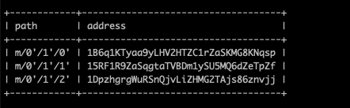
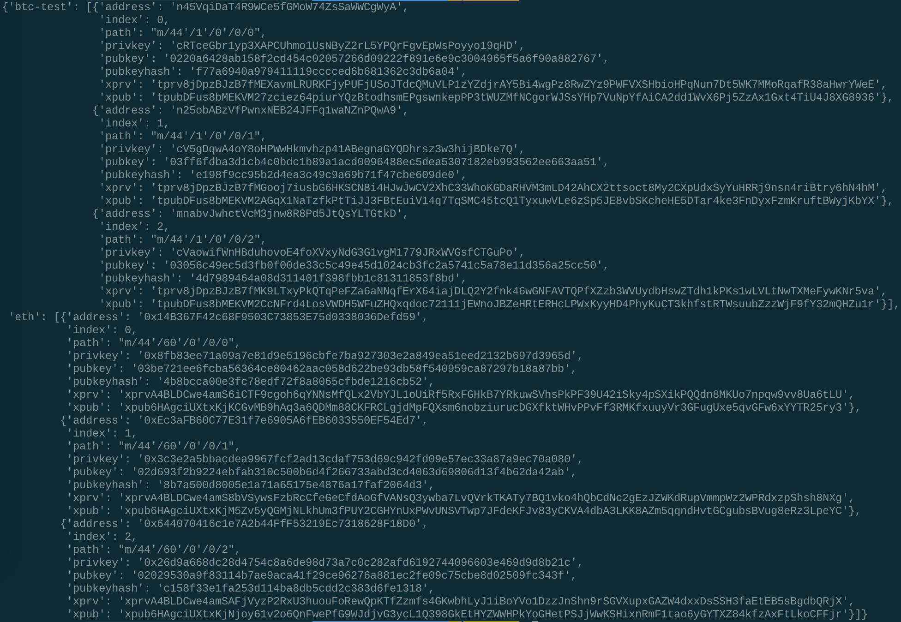

# Multi-Blockchain Wallet in Python


## Background

A new startup is focusing on building a portfolio management system that supports not only traditional assets
like gold, silver, stocks, etc, but crypto-assets as well! The problem is, there are so many coins out there! It's
a good thing you understand how HD wallets work, since you'll need to build out a system that can create them.

We are in a race to get to the market. There aren't as many tools available in Python for this sort of thing, yet.
Thankfully, you've found a command line tool, `hd-wallet-derive` that supports not only BIP32, BIP39, and BIP44, but
also supports non-standard derivation paths for the most popular wallets out there today! However, we need to integrate
the script into your backend with your dear old friend, Python.

Once we've integrated this "universal" wallet, we can begin to manage billions of addresses across 300+ coins, giving
us a serious edge against the competition.


## Dependencies

The following dependencies are required for this assignment . 

> **Important:** If you have _not_ already installed the dependencies listed below, you may do so by following the instructions found in the following guides:
  > - [HD Wallet Derive Installation Guide](Resources/HD_Wallet_Derive_Install_Guide.md) 
  > - [Blockchain TX Installation Guide](Resources/Blockchain_TX_Install_Guide.md).


### 1. Project setup

- Create a project directory called `wallet` and `cd` into it.

- Clone the `hd-wallet-derive` tool into this folder and install it using the [HD Wallet Derive Installation Guide](Resources/HD_Wallet_Derive_Install_Guide.md) 

- Create a symlink called `derive` for the `hd-wallet-derive/hd-wallet-derive.php` script. This will clean up the command needed to run the script in our code, as we can call `./derive` instead of `./hd-wallet-derive/hd-wallet-derive.php`: 

  - Make sure we are in the top level project directory - in this case the directory named `wallet`. 
  
  - we run the following command: `ln -s hd-wallet-derive/hd-wallet-derive.php derive`. 
  
   - Test that we can run the `./derive` script properly, by running the following command.  

    - ```
      ./derive --key=xprv9zbB6Xchu2zRkf6jSEnH9vuy7tpBuq2njDRr9efSGBXSYr1QtN8QHRur28QLQvKRqFThCxopdS1UD61a5q6jGyuJPGLDV9XfYHQto72DAE8 --cols=path,address --coin=ZEC --numderive=3 -g
      ```
  - The output should match what we see below:
    

- Create a file called `wallet.py` 
- The directory tree should look something like this:

  

### 2. Setup constants

- In a separate file, `constants.py`, set the following constants:
  - `BTC = 'btc'`
  - `ETH = 'eth'`
  - `BTCTEST = 'btc-test'`

- In `wallet.py`, import all constants: `from constants import *`


### 3. Generate a Mnemonic

- Generate a **new** 12 word mnemonic using `hd-wallet-derive` or by using [this tool](https://iancoleman.io/bip39/).

- Set this mnemonic as an environment variable by storing it a an `.env` file and importing it into your `wallet.py`.

### 4. Derive the wallet keys

- Create a function called `derive_wallets` that does the following:

  - Use the `subprocess` library to create a shell command that calls the `./derive` script from Python. Make sure to properly wait for the process. 
  - The following flags must be passed into the shell command as variables:
    - Mnemonic (`--mnemonic`) must be set from an environment variable, or default to a test mnemonic
    - Coin (`--coin`)
    - Numderive (`--numderive`) to set number of child keys generated
    - Format (`--format=json`) to parse the output into a JSON object using `json.loads(output)`

- Create a dictionary object called `coins` that uses the `derive_wallets` function to derive `ETH` and `BTCTEST` wallets.

- When done properly, the final object should look something like this (there are only 3 children each in this image):

  


### 5. Linking the transaction signing libraries

- Use `bit` and `web3.py` to leverage the keys stored in the `coins` object by creating three more functions:

  - `priv_key_to_account`:
  
    - This function will convert the `privkey` string in a child key to an account object that `bit` or `web3.py` can use to transact.
    - This function needs the following parameters:

      - `coin` -- the coin type (defined in `constants.py`).
      - `priv_key` -- the `privkey` string will be passed through here.

    - You will need to check the coin type, then return one of the following functions based on the library:

      - For `ETH`, return `Account.privateKeyToAccount(priv_key)`
          - This function returns an account object from the private key string. You can read more about this object [here](https://web3js.readthedocs.io/en/v1.2.0/web3-eth-accounts.html#privatekeytoaccount).
      - For `BTCTEST`, return `PrivateKeyTestnet(priv_key)`
          - This is a function from the `bit` libarary that converts the private key string into a WIF (Wallet Import Format) object. WIF is a special format bitcoin uses to designate the types of keys it generates. 
          - You can read more about this function [here](https://ofek.dev/bit/dev/api.html).

  - `create_tx`: 
    - This function will create the raw, unsigned transaction that contains all metadata needed to transact.
    - This function needs the following parameters:

      - `coin` -- the coin type (defined in `constants.py`).
      - `account` -- the account object from `priv_key_to_account`.
      - `to` -- the recipient address.
      - `amount` -- the amount of the coin to send.

    - We will need to check the coin type, then return one of the following functions based on the library:

      - For `ETH`, return an object containing `to`, `from`, `value`, `gas`, `gasPrice`, `nonce`, and `chainID`.
        Make sure to calculate all of these values properly using `web3.py`!
      - For `BTCTEST`, return `PrivateKeyTestnet.prepare_transaction(account.address, [(to, amount, BTC)])`

- `send_tx`:
  - This function will call `create_tx`, sign the transaction, then send it to the designated network.
  - This function needs the following parameters:

    - `coin` -- the coin type (defined in `constants.py`).
    - `account` -- the account object from `priv_key_to_account`.
    - `to` -- the recipient address.
    - `amount` -- the amount of the coin to send.

  
